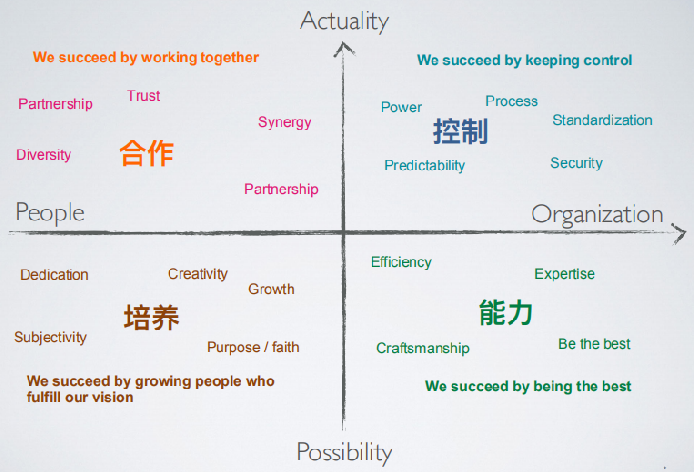
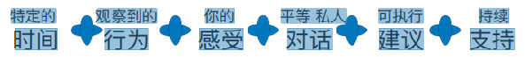
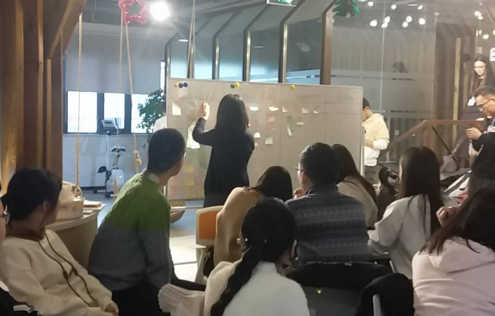

# TW 第一次文化培训课总结

E-mail： <1053364992@qq.com>        Time : 2019/01/31 

[TOC]
## 遇见TW
> The greatest benefit of travel is not to see how many people / see the beautiful scenery. but to walk in a situation / suddenly recognize yourself. 

&emsp;&emsp;特别喜欢地铁广告牌配图上的这句话，”旅行最大的好处，不是能见多少人，见过多少美丽的风景，而是走着走着，在一个际遇下，突然重新认识了自己“。就像遇见TW，让我们愿意停下脚步，重新认识自己，重新出发。
## Warm up

&emsp;&emsp;**收获**：Warm up环节现场主持人利用<u>姓名贴</u>做游戏的方式让大家很快熟悉起来，现场气氛非常活跃，深刻的感受到了TW开放的文化。

## Culture

&emsp;&emsp;该环节通过两个问题向大家介绍了TW的文化：_WHO AM I ? HOW DO WE WORK ?_

### WHO AM I ? 

&emsp;&emsp;[thoughtworks](https://baike.baidu.com/item/ThoughtWorks/5236600 "TW百科")是20世纪80年代后期创建的专业IT服务型公司。TW的三大支柱分别是：_经营可持续的业务；推动IT变革，追求软件卓越；积极提倡社会和经济公正。_

1. **经营可持续的业务**

   + 咨询服务：包括IT组织优化，技术咨询，测试策略，客户体验等。

   + 构建定制化系统和定制化产品：和客户一起完成极其复杂的项目和软件，尽可能快速的将概念转化为价值。

&emsp;&emsp;W的客户遍及电信、金融、出版、传媒、航运、能源、制造、互联网、旅游、保险等行业。

&emsp;&emsp;TW国际知名客户主要有Siemens、Amazon、Google、BGG、BT Financial Group、普华永道、HSBC、华纳兄弟、Lonely Planet、GAP、Sears等。

2. **推动IT变革，追求软件卓越**

   + 技术战略领导者：TW每年都会出品两期技术雷达，它以雷达形式对各类最新技术的成熟度进行评估并给出建议。它不仅涉及到新技术大趋势，更有细致到类库和工具的推荐和评论，因此更容易落地。
   + 技术社区推动者

3. **积极提倡社会和经济公正**

   + 社会公正工作

   + 招聘和多样性

&emsp;&emsp;TW致力于通过软件创造人类更美好的明天，倡导社会责任感，创造公平公正的经济环境。

### HOW DO WE WORK ?

+ Open：个人开放学习交流，公司信息透明。

+ Feedback：帮助他人和公司共同成长。

&emsp;&emsp;TW崇尚开放的工作环境，公司信息透明化，通过Feedback促进员工和公司的共同进步。

## Agile Methodology 

&emsp;&emsp;**敏捷**的关键点：

+ **<u>个体和交互</u> 高于 过程和工具。**
+ **<u>工作的软件</u> 高于 详尽的文档。**
+ **<u>客户合作</u> 高于 合同谈判。**
+ **<u>响应变化</u> 高于 遵循计划。**

&emsp;&emsp;**收获**：本次课程中，主持人通过游戏环节，让我们深刻理解到了敏捷方法在开发中的作用。让我们认识到在开发过程中Dev、BA、QA等角色都是不可或缺的，必须要能够保证各方进行有效的沟通，并且及时响应变化，最后还要尽量做到持续改进。

## Feedback

### 什么是反馈？

&emsp;&emsp;[反馈](https://baike.so.com/doc/5384190-5620599.html "百科")遵循于敏捷方法中的_**个体和互动**高于流程和工具_的思想。反馈来自于别人的关爱和在意，它的目的在于**帮助他人、提升自己、追求卓越。** 这也是TW文化中非常重要的一点，帮助他人和公司共同成长。

### 怎样给出反馈？

&emsp;&emsp;做出反馈时要注意以下几点：

   + 基于行为：反馈的内容要基于客观现实，基于反馈对象做出的行为，切忌主观臆断。

   + 对话：反馈时要注意对话方式。

   + 不要激进

   + 安全私人的环境：在安全的环境下进行反馈，安全私人的环境更容易让人接受反馈。

   + 越早越好：发现问题时，反馈越早进行越好，成效越好。

   + 不要太多：反馈最好一次只提一点，不要太多。

   + 可执行的Action：要提出可行的Action。

   + 支持对方

     给出反馈的公式如下：

     

### 怎样接受反馈？

&emsp;&emsp;接受反馈时要注意：

+ 保持开放的态度，不要抗拒。
+ 能够有效倾听
+ 感谢对方帮助自己提高和成长
+ 积极付出行动去提升

&emsp;&emsp;**收获**：在本次课程中，我们通过角色扮演的方式，完成了一次完整的反馈过程，了解了做出反馈和接受反馈时应该注意的要点。

## Retrospective

&emsp;&emsp;Retro的**目的**在于通过对工作过程的回顾，分析团队的改进空间，回顾是保持团队持续改善的重要工具。回顾会议要营造一个开放、自由、正向的气氛，不能演变成吐槽大会。回顾会议对事不对人，好的、不好的地方都应举实例说明，且最终要能引导团队做出整体改进建议，做出可行的Action。

&emsp;&emsp;在本次课程中，主持人带领我们对本次课程做了一次Retro，在现场主持人会保持Retro环境的开放、自由，清除不安全因素。并通过如下表格对本次课程进行回顾：

| Well | Less Well | Suggestion | Action |
|:----:|:---------:|:----------:|:------:|
|  xx  |   xx      | xx         |    xx  |

&emsp;&emsp;根据上表整理，我们对本次课程有了很完整的回顾，并且对需要改进的地方提出了建议和可行的Action。

